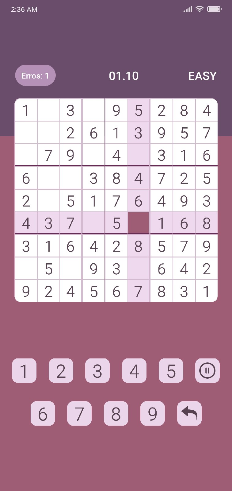
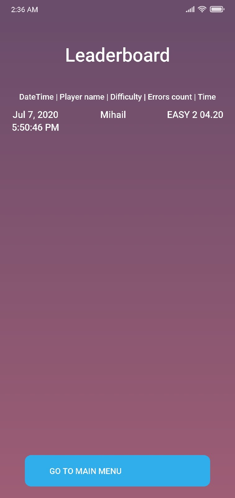

# RNSudoku - Sudoku game

Simple realisation of classic logic-based number puzzle game created with React Native and TypeScript.



### Table of Contents

* [General info](#general-info)
* [Technologies](#technologies)
* [Setup](#setup)

### General info

App was developed as part of internship. The goal of the game is to place 1 to 9 digit numbers into each grid cell so that each number can only appear once in each row, each column and each mini-grid.

### Technologies

* React Native: 0.62.2
* TypeScript: 3.7.7
* Redux: 4.0.5
* ReactNavigation: 4.2.2

### Setup

Clone project and open cloned directory:

```
git clone https://github.com/darkerthanblackoff/RNSudoku.git && cd RNSudoku
```

Yarn:

```
# Install dependencies:
yarn

# Run on Android:
yarn android 

# Run on IOS:
yarn ios
```

NPM:

```
# Install dependencies:
npm i

# Run on Android:
npx run android

# Run on IOS:
npx run ios
```
